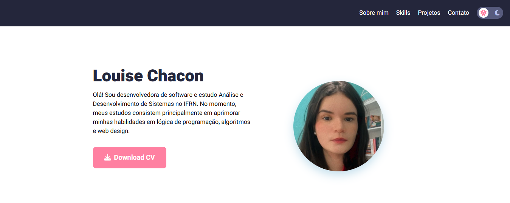

> Status: em andamento

# Portfólio - Louise Chacon

Projeto desenvolvido como um portfólio pessoal, com o intuito de registrar meus demais trabalhos como desenvolvedora de software em formação.

## Funcionalidades

- Seção de apresentação;
- Exibição das minhas principais tecnologias e habilidades;
- Registros dos meus projetos realizados até o momento;
- Formulário para entrar em contato.

## Tecnologias utilizadas

- HTML5;
- CSS3 (Grid/Flexbox);
- JavaScript;
- Vercel para deploy.

## O portfólio está disponível em:
https://louise-chacon-dev.vercel.app/

## Autoria própria
- [@louisechacon](https://github.com/louisechacon)